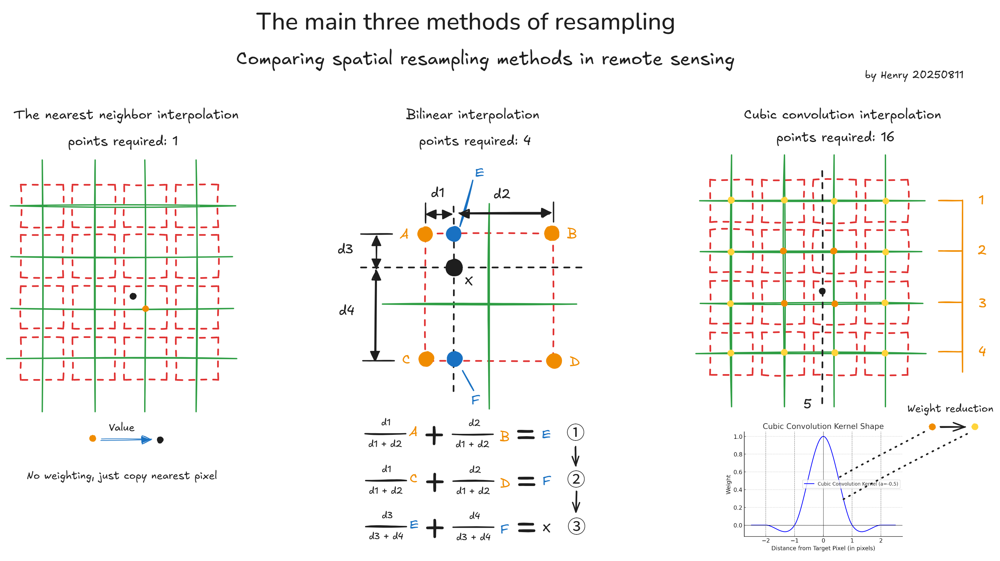

# Remote Sensing Image Acquisition, Analysis, and Applications – Learning Notes

## Overview

This repository documents my complete learning journey through the Coursera course [Remote Sensing Image Acquisition, Analysis, and Applications](https://www.coursera.org/learn/remote-sensing). It is part of my broader PhD preparation plan in AI-powered environmental monitoring and blue carbon sink estimation.

**Course Provider:** from [John Richards](https://www.coursera.org/instructor/john-richards), Emeritus Professor at The University of New South Wales, delivered via Coursera

**Modules:** 15 total, covering theory, data acquisition methods, preprocessing, analysis, and application of remote sensing in environmental and resource management.

Almost all diagrams in this repository are self-made and copyright-owned by me. Screenshots from the course are used sparingly, only when necessary, and are properly attributed under each figure. These materials are strictly for educational and non-commercial purposes.

---

## Repository Structure

```
remote-sensing-course/
│
├── README.md                  # Course overview and navigation
├── week 1/                    # Week 1 learning notes and assets
│   ├── RS week 1.md          # Week 1 comprehensive notes
│   └── RS week 1.assets/     # Week 1 diagrams and images
├── week 2/                    # Week 2 learning notes and assets
│   ├── RS week 2.md          # Week 2 comprehensive notes
│   └── RS week 2.assets/     # Week 2 diagrams and images
├── week 3/                    # Week 3 learning notes and assets
│   ├── RS week 3.md          # Week 3 comprehensive notes
│   └── RS week 3.assets/     # Week 3 diagrams and images
├── week 4/                    # Week 4 learning notes and assets
│   ├── RS week 4.md          # Week 4 comprehensive notes
│   └── Week 4.assets/        # Week 4 diagrams and images
├── week 5/                    # Week 5 learning notes and assets
│   ├── RS week 5.md          # Week 5 comprehensive notes
│   └── Week 5.assets/        # Week 5 diagrams and images
├── week 6/                    # Week 6 learning notes and assets
│   ├── RS week 6.md          # Week 6 comprehensive notes
│   └── Week 6.assets/        # Week 6 diagrams and images
├── week 7/                    # Week 7 learning notes and assets
│   ├── RS week 7.md          # Week 7 comprehensive notes
│   └── Week 7.assets/        # Week 7 diagrams and images
├── week 8/                    # Week 8 learning notes and assets
│   ├── RS week 8.md          # Week 8 comprehensive notes
│   └── Week 8.assets/        # Week 8 diagrams and images
├── python_code/               # Python scripts for generating diagrams
│   ├── Integrated script to reproduce the target image.py
│   ├── Cubic Convolution Kernel Shape.py
│   ├── Effect Of Normalization On Solar Spectrum.py
│   ├── High-Order Vs Low-Order Polynomial Fitting.py
│   ├── Match the means and standard deviations.py
│   ├── Oversampling.py
│   ├── Biased vs Unbiased Variance Estimation.py
│   ├── Mean Vector and Covariance Ellipse in Spectral Space.py
│   ├── PCA_Coordinate_Transformation_Visualization.py
│   ├── Low variance (PC5-PC6) Quantization dominates (noise).py
│   ├── 3D heat-colored discriminant surface for two Gaussian mixtures.py
│   ├── True Distribution vs Gaussian Approximations.py
│   ├── Spectral class vs information class.py
│   ├── Common Activation Functions.py
│   └── Understanding oscillations in neural network training.py
└── README.assets/             # README diagrams and images
```

---

## 📚 Learning Notes Navigation

### ✅ Completed Modules

| Week | Topic | Notes | Key Concepts | Status |
|------|-------|-------|--------------|---------|
| **Week 1** | **Image Acquisition & Error Correction** | [📖 RS week 1.md](week%201/RS%20week%201.md) | - Remote sensing fundamentals<br/>- Atmospheric effects<br/>- Imaging platforms<br/>- Scanner types | ✅ Completed 2025-08-06 |
| **Week 2** | **Image Distortions & Corrections** | [📖 RS week 2.md](week%202/RS%20week%202.md) | - Radiometric distortions<br/>- Geometric distortions<br/>- Correction techniques<br/>- Mathematical modeling | ✅ Completed 2025-08-10 |
| **Week 3** | **Geometric Correction & Resampling** | [📖 RS week 3.md](week%203/RS%20week%203.md) | - Control points<br/>- Mapping functions<br/>- Resampling methods<br/>- Image registration | ✅ Completed 2025-08-12 |
| **Week 4** | **Classification & Thematic Mapping** | [📖 RS week 4.md](week%204/RS%20week%204.md) | - Classification fundamentals<br/>- Supervised learning<br/>- Correlation & covariance<br/>- Principal Component Analysis | ✅ Completed 2025-08-16 |
| **Week 5** | **Principal Components Transform** | [📖 RS week 5.md](week%205/RS%20week%205.md) | - PCA worked examples<br/>- Data compression<br/>- Feature reduction<br/>- Change detection applications | ✅ Completed 2025-08-17 |
| **Week 6** | **Machine Learning in Remote Sensing** | [📖 RS week 6.md](week%206/RS%20week%206.md) | - Image analysis fundamentals<br/>- Maximum likelihood classifier<br/>- Minimum distance classifier<br/>- Bayes theorem applications | ✅ Completed 2025-08-20 |
| **Week 7** | **Linear Classifiers Training** | [📖 RS week 7.md](week%207/RS%20week%207.md) | - Supervised learning<br/>- Linear classification<br/>- Training algorithms<br/>- Performance evaluation | ✅ Completed 2025-08-24 |
| **Week 8** | **Neural Network Structure & Training** | [📖 RS week 8.md](week%208/RS%20week%208.md) | - Neural network fundamentals<br/>- Activation functions<br/>- Multilayer perceptron<br/>- Backpropagation training | ✅ Completed 2025-08-28 |

### ⏳ Upcoming Modules

| Week | Topic | Status | Expected Focus |
|------|-------|--------|----------------|
| **Week 9** | CNN in remote sensing | ⏳ | - Convolutional networks<br/>- Spatial feature extraction |
| **Week 10** | Unsupervised classification | ⏳ | - Clustering algorithms<br/>- Pattern recognition |
| **Week 11** | Practical classification matters | ⏳ | - Real-world applications<br/>- Accuracy assessment |
| **Week 12** | Thematic map accuracy | ⏳ | - Validation methods<br/>- Error analysis |
| **Week 13** | Imaging radar nature | ⏳ | - SAR principles<br/>- Radar characteristics |
| **Week 14** | Radar energy scattering | ⏳ | - Scattering mechanisms<br/>- Surface interactions |
| **Week 15** | Radar geometric corrections | ⏳ | - Distortion types<br/>- Correction techniques |

---

## 🚀 Quick Start

### Prerequisites
- Python 3.8+
- Git

### Installation
```bash
git clone https://github.com/henrypan1993/remote-sensing-learning-notes.git
cd remote-sensing-learning-notes
pip install -r requirements.txt
```

### Running Examples
```bash
cd python_code
python "PCA_Coordinate_Transformation_Visualization.py"
```

## 📊 Repository Statistics


## 🎯 Learning Objectives

By the end of this course, I aim to:

1. Understand the fundamentals of remote sensing theory and data acquisition.
2. Master preprocessing techniques for various sensor data (multispectral, SAR, LiDAR).
3. Apply image analysis and classification methods to environmental monitoring.
4. Gain hands-on experience with remote sensing software and cloud platforms (e.g., Google Earth Engine).
5. Build a knowledge base to support AI-powered carbon sink estimation research.

---

## 🖼️ Example Diagrams

Below are sample diagrams from my notes:



As shown in the picture above, I will redraw images using Python or Excalidraw based on my own understanding of the learning content, aiming for efficient and elegant visual expression. These images have been created with a great deal of effort, thus becoming the essence of my study notes.

---

## 🐍 Python Code Examples

The `python_code/` directory contains 15 scripts that generate various diagrams and visualizations:

- **Integrated script to reproduce the target image.py** - FOV projection visualization
- **Cubic Convolution Kernel Shape.py** - Convolution kernel visualization
- **Effect Of Normalization On Solar Spectrum.py** - Spectral normalization effects
- **High-Order Vs Low-Order Polynomial Fitting.py** - Polynomial fitting comparison
- **Match the means and standard deviations.py** - Statistical matching
- **Oversampling.py** - Oversampling technique demonstration
- **Biased vs Unbiased Variance Estimation.py** - Variance estimation comparison
- **Mean Vector and Covariance Ellipse in Spectral Space.py** - Statistical visualization
- **PCA_Coordinate_Transformation_Visualization.py** - PCA transformation demonstration
- **Low variance (PC5-PC6) Quantization dominates (noise).py** - Low variance component analysis
- **3D heat-colored discriminant surface for two Gaussian mixtures.py** - 3D discriminant surface visualization
- **True Distribution vs Gaussian Approximations.py** - Distribution comparison analysis
- **Spectral class vs information class.py** - Class mapping visualization
- **Common Activation Functions.py** - Neural network activation functions visualization
- **Understanding oscillations in neural network training.py** - Neural network training oscillation analysis

---

## 🤝 Contributing
This is a personal learning repository, but suggestions and corrections are welcome through Issues and Pull Requests. See [CONTRIBUTING.md](CONTRIBUTING.md) for details.

## 📞 Contact
- GitHub: [@henrypan1993](https://github.com/henrypan1993)
- Research Focus: AI-powered environmental monitoring, blue carbon sink estimation

## 🙏 Acknowledgments
- **Course Instructor**: John Richards, Emeritus Professor at The University of New South Wales
- **Platform**: Coursera
- **Course**: [Remote Sensing Image Acquisition, Analysis, and Applications](https://www.coursera.org/learn/remote-sensing)

## License

All original diagrams and notes are licensed under **CC BY-NC 4.0** (Attribution-Noncommercial). All original diagrams © Henry Pan. Course slides are used under fair use for educational purposes. Not for commercial use.

