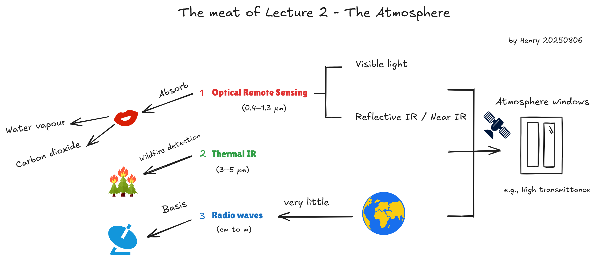
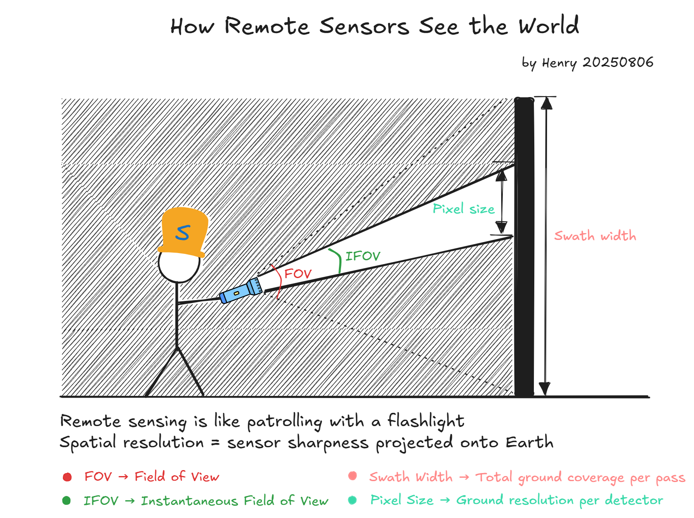

# REMOTE SENSING IMAGE ACQUISITION, ANALYSIS AND APPLICATIONS - Week 1

Course tutor: John Richards

All original diagrams © Henry Pan. Course slides are used under fair use for educational purposes. Not for commercial use.

### Summary of Course Modules

| Module         | Topic                                          | Key Focus Areas                                              |
| -------------- | ---------------------------------------------- | ------------------------------------------------------------ |
| **Module 1**   | Image Acquisition & Error Correction           | - Sensor physics and technology - Electromagnetic radiation - Atmospheric and surface reflectance  - Sources of image distortion - Correction techniques |
| **Module 2**   | Image Analysis & Machine Learning              | - Extracting information from images - Basics of machine learning - Algorithms applied to remote sensing data |
| **Module 3.1** | Practical Applications of ML in Remote Sensing | - Applying Module 2 concepts to real-world tasks - Hands-on examples and workflows |
| **Module 3.2** | Radar Remote Sensing Techniques                | - Introduction to radar technology - Radar image interpretation - Use cases in remote sensing applications |
## Lecture1 what is Remote Sensing

> In simple terms remote sensing is the technology of recording images of portions of the earth’s surface from spacecraft, aircraft and other platforms in order to understand the surface by analyzing and interpreting those images

### Four blocks of remote sensing system

- The first is the energy that is detected by the platform
- The second is thedownlinking of the signal which carries the information recorded by the detecto
- There can be errors in brightness and contrast relative to theactual brightness and contrast of scene and being imaged.
- Once those errors have been corrected we have the images in a form that canbe used in applications

> It is a course in remote sensing, which means we use image analysis as an important tool, but the end point is understanding what an image has recorded in terms of ground features.

## Lecture 2 The atmosphere

> the effect of the atmosphere on the transmission of radiation is wavelength dependent

| Component            | Volume Percentage                                            | Notes                                                        |
| -------------------- | ------------------------------------------------------------ | ------------------------------------------------------------ |
| Nitrogen (N₂)        | Approximately 78.08%                                         | The most abundant component, mainly derived from biological nitrogen fixation and releases from the Earth's interior, and is an important constituent of proteins in organisms. |
| Oxygen (O₂)          | Approximately 20.95%                                         | A key gas for sustaining life activities, primarily produced through plant photosynthesis. |
| Argon (Ar)           | Approximately 0.93%                                          | An inert gas, the most abundant noble gas in the atmosphere, originating from the decay of radioactive elements within the Earth. |
| Carbon Dioxide (CO₂) | Approximately 0.04% (around 420 ppm, and increasing year by year) | One of the greenhouse gases, crucial for regulating the Earth's climate, with its content significantly affected by human activities (such as fossil fuel combustion). |
| Neon (Ne)            | Approximately 0.0018%                                        | An inert gas, commonly used in neon lights and other lighting equipment. |
| Helium (He)          | Approximately 0.0005%                                        | An inert gas with low density, mainly obtained from natural gas extraction and the decay of radioactive elements. |
| Methane (CH₄)        | Approximately 0.00017% (around 1.7 ppm)                      | A potent greenhouse gas, primarily emitted from wetlands, animal husbandry, and fossil fuel extraction. |
| Krypton (Kr)         | Approximately 0.00011%                                       | An inert gas, applicable in laser technology and other fields. |
| Hydrogen (H₂)        | Approximately 0.00005%                                       | Present in extremely low concentrations, mainly from biological metabolism and industrial emissions. |
| Other trace gases    | Less than 0.001%                                             | Including xenon (Xe), ozone (O₃, mainly concentrated in the stratosphere), nitrous oxide (N₂O), etc. |

**Note**: The atmosphere also contains water vapor (H₂O), but its content varies greatly, usually ranging between 0-4% by volume, and is significantly affected by climate, geographical location, and altitude.

Remote sensing imaging relies on **atmospheric windows** (i.e., wavebands where the atmosphere weakly absorbs electromagnetic waves, such as visible light (0.4 - 0.7μm), near-infrared (0.7 - 1.3μm), thermal infrared (8 - 14μm), and microwaves). However, **the absorption bands of water vapor and CO₂ are precisely adjacent to or partially overlap with these windows**, causing the radiation signals within the windows to be weakened and requiring focused correction.

**Radar remote sensing usually requires illuminating the Earth's surface with artificial energy**. This is because the natural radio energy emitted by the Earth itself is extremely limited. To utilize the atmospheric window with an extremely wide range of radio wave bands, remote sensing platforms generally need to be equipped with a radio receiver.

## Lecture 3: What platforms are used for imaging the Earth surface?

This way of simplifying the **atmospheric column** is analogous to taking a sample with a dropper—where the sample takes the form of a liquid column—and its core idea is similar to that of calculus.

### Satellites

- Earth-orbiting satellites have long been the dominant remote sensing platform, offering global coverage but limited spatial resolution
- While they avoid atmospheric interference, their designs are fixed once launched, limiting flexibility
- The field is now shifting toward low-cost microsatellite constellations, which may enable collaborative, adaptive imaging over time

### Aircraft

- Pros
  - Aircraft can sometimes choose imaging wavelengths best suited to the application
  - Aircraft can achieve higher spatial resolution than satellites
  - Aircraft allow control over where and how often imaging occurs
- Cons
  - Turbulence and other atmospheric factors affect platform stability and can cause geometric distortion
  - Aircraft missions often require end users to cover full costs

### Drone

- Pros
  - Very high spatial resolution in the recorded images is possible
  - Users often configure imaging devices to meet particular needs
  - Usage-specific flight paths can be programmed, e.g. for fence or power line inspection
  - The platforms and their sensors can be very inexpensive
- Cons
  - Drone remote sensing is a relatively new means with limited accumulated experience
  - Affected by atmosphere and flight characteristics; attitude control is critical
  - Images are usually for a very small group of users who own the platform

> Most remote sensing satellites have a mid-morning descending node, in order to allow sufficient shadowing to reveal geomorphological features

“Shadowing” refers to the real shadows of ground objects; although the 10 - meter - level resolution of satellites is not very high, the scale of shadows of macro - landforms is far larger than the pixel size, so they can be identified. Its core role is to enhance the three - dimensional sense of landforms using shadows and assist in interpreting “geomorphological features”, and it is a classic means of remote sensing image interpretation (similar to how the human eye judges terrain relief through shadows).

In a short, shadows are the "3D code" of remote sensing images, decrypting the compressed 3D information back to humans!

## Lecture 4: How do we record images of the Earth's surface?

This part introduces three types of scanner are common

- 线扫描器 The Line Scanner
- 推式扫帚扫描器 The Push Broom Scanner
- 高光谱扫描仪 The Hyperspectral Scanner

> Most often, the IFOV is the same in the **along-track** and **cross-track** directions

To make the ground dimensions of image pixels as consistent as possible in both directions, thereby balancing the resolution. As a result, the pixels may appear close to **square** in shape, yet the scanning process and its essence lie in the design logic of balanced resolution.

> With the line scanner that is achieved by placing a dispersive element in the path of the radiation

Each pixel corresponds to a complete spectral signature, and the entire image forms a three-dimensional data cube of "spatial × spectral" dimensions, where the brightness values are discrete.

> The number of brightness values (often expressed as the number of bits) is called the dynamic range or radiometric resolution of the sensor

Radiometric resolution = m

We could say, "This sensor has **a radiometric resolution of 12 bits**"

In this Lecture, we should notice:

**Geometric characteristics**:

- Related to **position**, **size**, **shape**, and **geolocation accuracy**
- Examples: pixel size, frame size, swath width, spatial resolution, sensor footprint

**Spectral characteristics**:

- Related to **wavelengths**, **bands**, and **color information**
- Examples: number of bands, spectral resolution, specific spectral ranges (e.g., VNIR, SWIR)

**Radiometric characteristics**:

- Related to the **precision of brightness values**
- Measured in **bits**, determines the number of discrete intensity levels
- Examples: radiometric resolution (e.g., 8-bit = 256 levels)