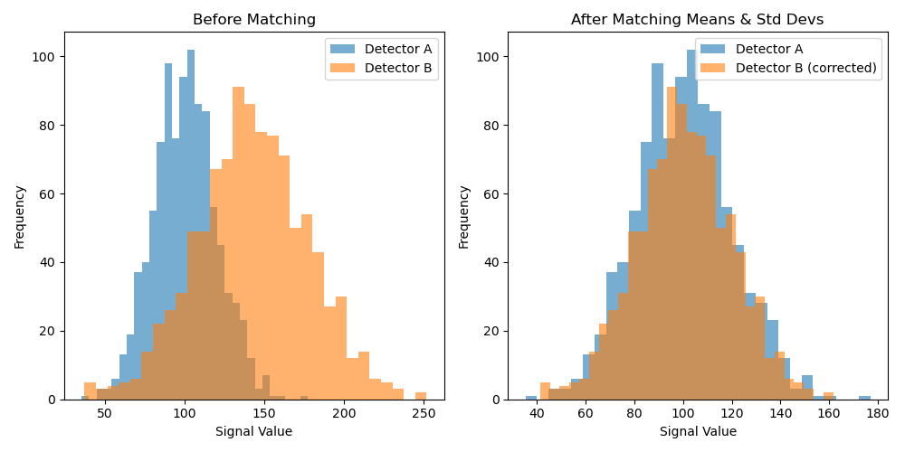
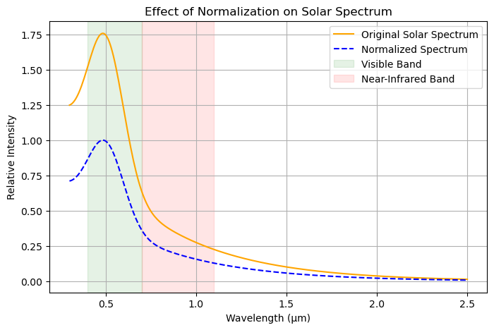
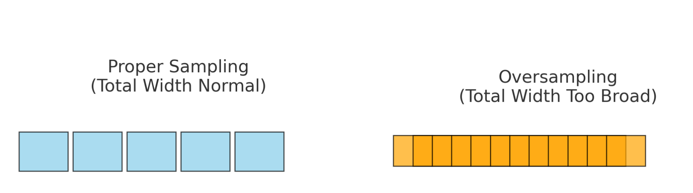
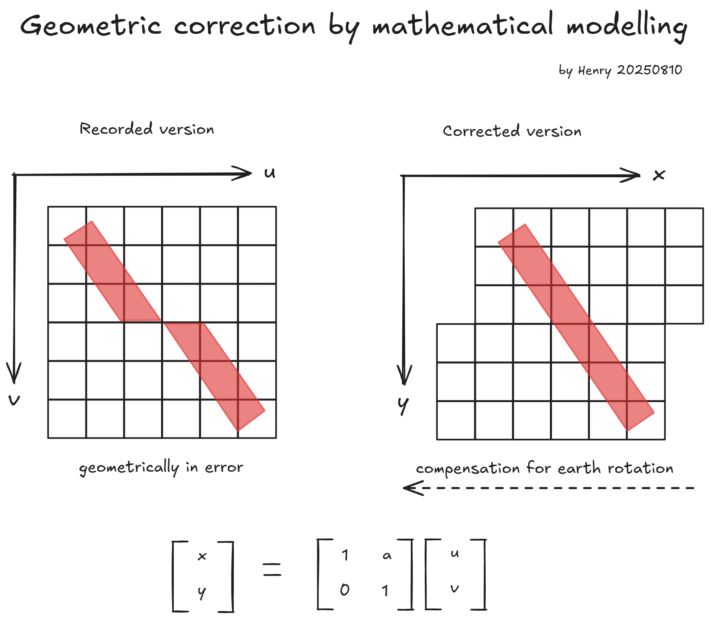

# REMOTE SENSING IMAGE ACQUISITION, ANALYSIS AND APPLICATIONS - Week 2

Course tutor: John Richards

All original diagrams © Henry Pan. Course slides are used under fair use for educational purposes. Not for commercial use.

## Lecture 5. What are we trying to measure?

The color of soil is determined by its reflectance characteristics across the visible light spectrum (0.4–0.7 μm). Soils rich in iron reflect more strongly in the red wavelengths, while black soils with high organic content absorb more light across all wavelengths, resulting in a darker appearance

> when looking at cover types such as water, the remote sensing specialist needs to be aware that the reflectance observed can be mixtures of more pure materials

🔍 Quick Tip: Use Spectral Range to Guess Sensor Application

When you come across a remote sensing sensor, check its spectral range first — this often gives you a strong clue about its main application

- multispectral: about 10 wave bands
- hyperspectral: more than100

## Lecture 6. Distortions in recorded images

> An important reason for understanding the corrections of distortions in image geometry is that the techniques we employ for correction can also be used to register images to maps, and images to other images

Understanding the fundamentals of algorithms helps grasp their limitations and characteristics—and this principle applies to any computer-based image processing.

> Distortions can occur in the geometry of an image and in its brightness (radiometric distortions)

### Radiometric

- caused by the properties of the instruments themselves
  - Gain
  - Offset
- caused by the shape of the solar the radiation curve
- caused by the effect of the atmosphere and particularly how the effect of the atmosphere varies with wavelength

Addressing distortions caused by instrument characteristics: gain and offset correction (e.g., Z-score standardization and translation)

Addressing distortions caused by the shape of the solar radiation spectrum: radiometric calibration with normalization to ensure inter-band comparability

Addressing distortions caused by atmospheric effects: removing path radiance and diffuse downwelling radiance from the radiative transfer equation

### Lecture 7. Geometric distortions in recorded images

> images from aircraft and drones are often not corrected for these sorts of error, so you need to know how to do that yourself

What are the sources of geometric distortions?

- the effect of earth rotation
- the large FOV of sensors
- Instrumentation Effects
  - finite acquisition time for scanners
  - aspect ratio distortion 纵横比失真
    - too fast the pixels overlap
    - too slow the pixels have spaces between them

Why the model of grid is very important?

When we consider the compression effect on image edges, why does this phenomenon occur? That is to say, why is the compression not concentrated at the center? 

Conception of panoramic distortion or S-bend distortion

.png)Pixels at the image edges cover a larger ground area due to sensor viewing geometry, but are rescaled to match the uniform grid in the projected image

> The visual affect is to give the impression that the image rolls off at the edges

To correct finite acquisition time for scanners

> The scanning window is chosen to exclude the extreme non-linearities at the scan edges

too fast - Pixel overlap - the recorded image is too broad, not too narrow

### Lecture 8. Correcting geometric distortion

> The first involves setting up mathematical equations which describe the types of distortion and then using those equations to correct the distortions

### Other kinds of geometric distortion

**Effect of earth rotation**
$$
\begin{bmatrix}
x \\
y
\end{bmatrix}
=
\begin{bmatrix}
1 & \alpha \\
0 & 1
\end{bmatrix}
\begin{bmatrix}
u \\
v
\end{bmatrix}
\
$$
**Aspect ratio correction** （resulting from over - or under - sampling across the scan line）
$$
\begin{bmatrix}
x \\
y
\end{bmatrix}
=
\begin{bmatrix}
1 & 0 \\
0 & \beta
\end{bmatrix}
\begin{bmatrix}
u \\
v
\end{bmatrix}
$$
**Panoramic effects**
$$
\begin{bmatrix}
x \\
y
\end{bmatrix}
=
\begin{bmatrix}
\tan{\theta} & 0 \\
0 & 1
\end{bmatrix}
\begin{bmatrix}
u \\
v
\end{bmatrix}
\
$$
**Image orientation to north - south**
$$
\begin{bmatrix}
x \\
y
\end{bmatrix}
=
\begin{bmatrix}
\cos{\zeta} & \sin{\zeta} \\
-\sin{\zeta} & \cos{\zeta}
\end{bmatrix}
\begin{bmatrix}
u \\
v
\end{bmatrix}
\
$$
These corrections use **linear transformations** to map the original pixel coordinates $(u, v)$ into a new coordinate system $(x, y)$

Each transformation matrix corresponds to a specific geometric distortion model (e.g., Earth rotation, aspect ratio, panoramic effect, orientation)

Mathematically, this process is equivalent to **changing the basis** so that points are re-expressed in a corrected reference frame, thereby removing the targeted distortion

---

The Internal Connection of two methods

- **Same goal**: Both aim to find a mapping function from distorted coordinates to true coordinates:
  $$
  f: (u, v) \rightarrow (x, y)
  $$

- Difference lies in the source of f:

  - **Method 1**: f comes from a physical/geometry model (explicit formulas + physical parameters)
  - **Method 2**: f comes from data fitting (polynomial or interpolation)

- **Possibility of combination**: In practical engineering, the two are often combined — a physics-based formula is used for the initial correction, followed by fitting to remove residual errors

