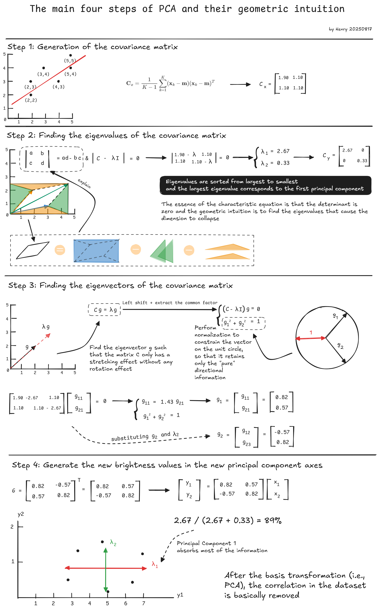
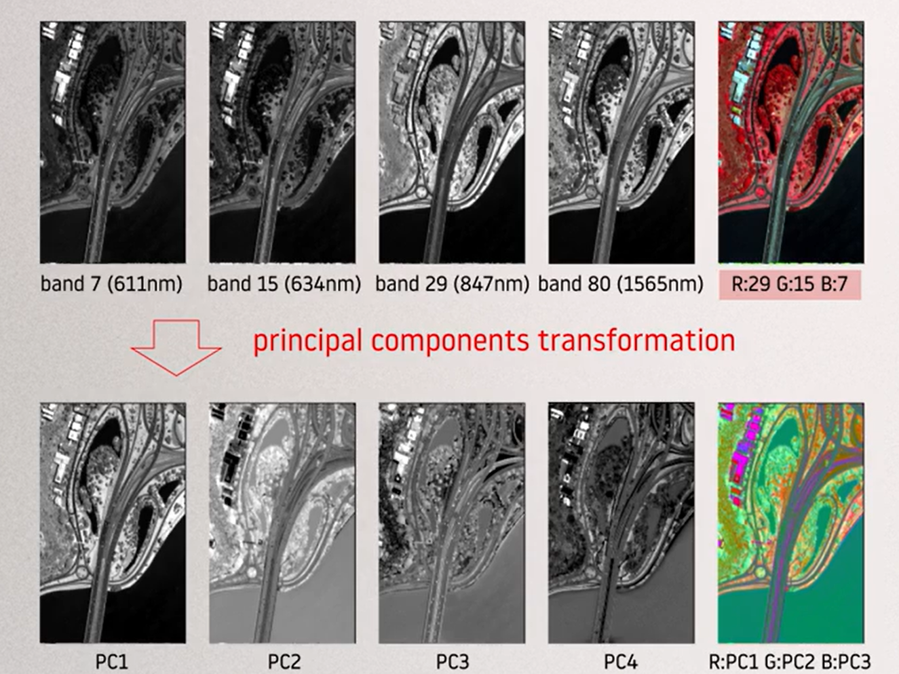
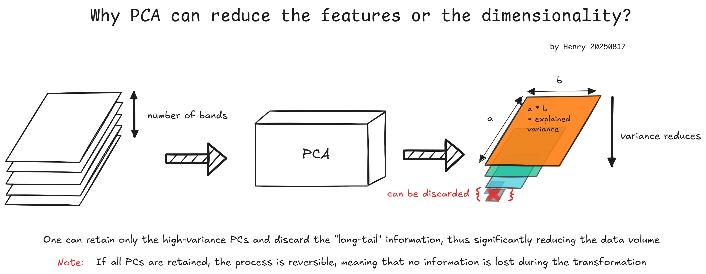
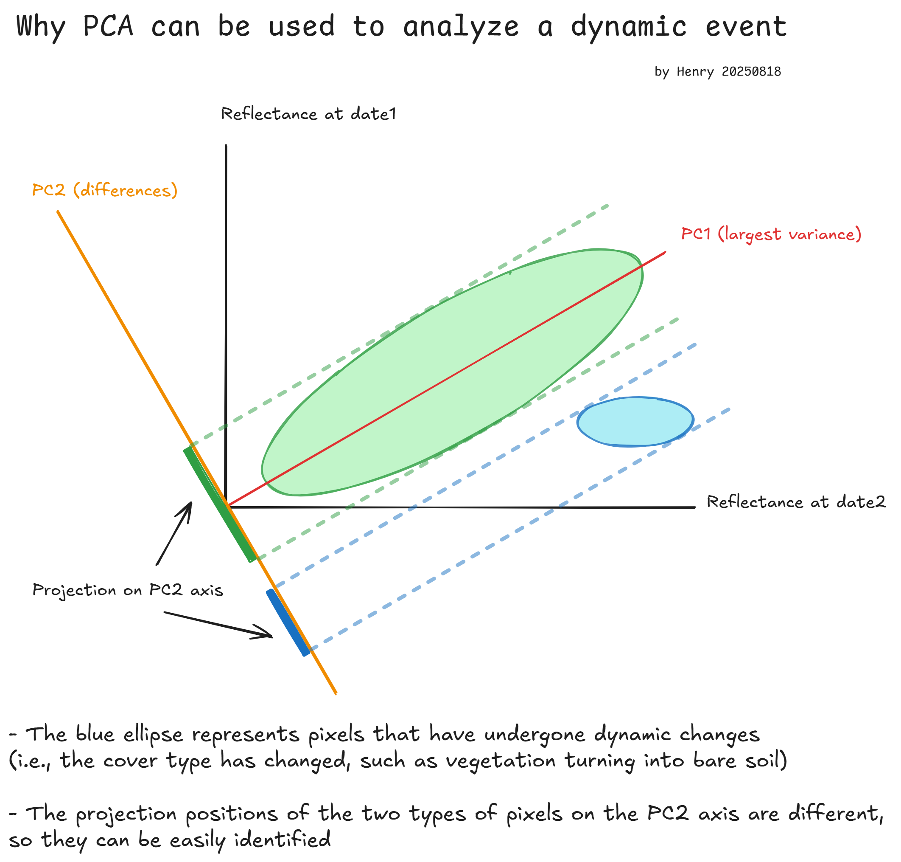

# REMOTE SENSING IMAGE ACQUISITION, ANALYSIS AND APPLICATIONS - Week 5

Course tutor: John Richards

All original diagrams © Henry Pan. Course slides are used under fair use for educational purposes. Not for commercial use.

## Lecture 18. The principal components transform: worked example

The main four steps:

- Generation of the covariance matrix of the image data
- Finding the eigenvalues and the eigenvectors of the covariance matrix
- Rank ordering the eigenvalues to identify the first, second and subsequent principal components 
- Using the transposed matrix of eigenvectors in y= Gx to generate the new brightness values for the image pixels in the new principal component axes

## Lecture 19. The principal components transform: a real example

*image source: slide 1.19.3 of this course*

Notice: When the contrast of the three channels is enhanced respectively and the values become relatively close, the characteristic that the human eye is more sensitive to green appears, resulting in the overall greenish tint of the picture
$$
\begin{equation}
Y = 0.59G + 0.30R + 0.11B
\end{equation}
$$
In summary:

- The correlation among bands can often be judged visually: if a series of band images looks very similar, the correlation is relatively high
- PCA tends to be more effective when the original bands are highly correlated; for low-correlation bands, the transformation usually brings less benefit, even though some color variation (e.g., purple tones) may appear
- When each RGB channel undergoes individual contrast enhancement, even components with a relatively low variance contribution can reveal additional details
- If the intensity of the three RGB channels is close, the image is often perceived as greenish, because the human eye is more sensitive to green

## Lecture 20. Applications of the principal components transform

### To help photointerpretation

- Aid photointerpretation: Analyze colors in color image products and their relation to spectral reflectance of different cover types
- Serve geology/geomorphology: Prioritize colors’ role in delineating structures/lithologies and enhancing features (e.g., lineaments), not just actual hues
- Highlight image features: PCA - derived colors (per last lecture’s example) emphasize subtle details hidden in original image bands

### To compress data

.png)

Discretization noise means that when there is too little remaining information, the sensor's own digitization limitations "override" the real signal

For data compression:

- Retaining all principal components is lossless (reversible)
- When some principal components are discarded, the inverse transformation only achieves an approximate reconstruction and is not a true inverse operation

> There are actually many ways of reducing the number of features in a classification exercise. The use of PCs is one of the simplest

### To reduce the number of features(bands)

### to detect changes between images

| Component | Eigenvalue | Col1  | Col2  | Col3  | Col4  | Col5  | Col6  | Col7  | Col8  |
| --------- | ---------- | ----- | ----- | ----- | ----- | ----- | ----- | ----- | ----- |
| 1         | 1884       | 0.14  | 0.21  | 0.38  | 0.38  | 0.15  | 0.30  | 0.53  | 0.50  |
| 2         | 236        | 0.24  | 0.32  | -0.21 | -0.45 | 0.36  | 0.63  | 0.06  | -0.25 |
| 3         | 119        | 0.24  | 0.21  | 0.49  | 0.46  | 0.07  | 0.08  | -0.40 | -0.53 |
| 4         | 19         | -0.51 | -0.58 | -0.03 | 0.27  | 0.13  | 0.55  | -0.04 | -0.12 |
| 5         | 6          | 0.37  | -0.50 | 0.07  | -0.04 | 0.38  | -0.30 | 0.49  | -0.37 |
| 6         | 5          | 0.44  | -0.14 | -0.54 | 0.41  | 0.31  | 0.00  | -0.37 | -0.32 |
| 7         | 4          | -0.17 | 0.35  | -0.52 | 0.45  | -0.19 | -0.05 | 0.42  | -0.39 |
| 8         | 3          | 0.50  | -0.29 | -0.04 | -0.02 | -0.74 | 0.34  | 0.08  | -0.04 |

- Eigenvalues drop rapidly → Information mainly concentrates in PC1
- All elements of PC1’s eigenvector are positive → It’s like “a weighted average of all bands”
- Thus, PC1 often represents the image’s most intuitive “overall brightness/energy” component

$$
PC1 = w_1 \cdot \text{band}_1 + w_2 \cdot \text{band}_2 + \cdots + w_n \cdot \text{band}_n, \text{in which } w_i > 0。
$$

But if our purpose is to discern the differences between two images, the “overall brightness" can't work. Thus:

- For overall brightness/terrain/energy info → Check PC1
- For detailed differences/feature changes → Look at higher - order PCs like PC2, PC3
