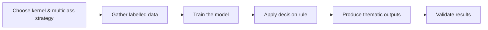

# REMOTE SENSING IMAGE ACQUISITION, ANALYSIS AND APPLICATIONS - Week 7

Course tutor: John Richards

All original diagrams © Henry Pan. Course slides are used under fair use for educational purposes. Not for commercial use.

## Lecture 5. Training a linear classifier

> In remote sensing, don't necessarily use a complicated classifier when a simple one will do the job just as well


### The deviation of decision rule

If the distances are to be equal：
$$d(\mathbf{x}, \mathbf{m}_i)^2 = d(\mathbf{x}, \mathbf{m}_j)^2$$
Now, from vector Euclidean geometry the squared magnitudes of the distances are
$$d(\mathbf{x}, \mathbf{m}_i)^2 = (\mathbf{x} - \mathbf{m}_i)^\mathrm{T} (\mathbf{x} - \mathbf{m}_i)$$

$$d(\mathbf{x}, \mathbf{m}_j)^2 = (\mathbf{x} - \mathbf{m}_j)^\mathrm{T} (\mathbf{x} - \mathbf{m}_j)$$

Giving

$$\mathbf{x}^\mathrm{T}\mathbf{x} - \mathbf{m}_i^\mathrm{T}\mathbf{x} - \mathbf{x}^\mathrm{T}\mathbf{m}_i + \mathbf{m}_i^\mathrm{T}\mathbf{m}_i = \mathbf{x}^\mathrm{T}\mathbf{x} - \mathbf{m}_j^\mathrm{T}\mathbf{x} - \mathbf{x}^\mathrm{T}\mathbf{m}_j + \mathbf{m}_j^\mathrm{T}\mathbf{m}_j$$

so that, noting：

$$\mathbf{y}^\mathrm{T}\mathbf{z} = \mathbf{z}^\mathrm{T}\mathbf{y} \text{ and } (\mathbf{y}^\mathrm{T} + \mathbf{z}^\mathrm{T}) = (\mathbf{y} + \mathbf{z})^\mathrm{T}$$

Then

$$
2(\mathbf{m}_j - \mathbf{m}_i)^\mathrm{T} \mathbf{x} + (\mathbf{m}_i^\mathrm{T}\mathbf{m}_i - \mathbf{m}_j^\mathrm{T}\mathbf{m}_j) = 0
$$

### compared with MLC and MDC

| Step             | Maximum Likelihood Classifier (MLC)                          | Minimum Distance Classifier (MDC)                            |
| ---------------- | ------------------------------------------------------------ | ------------------------------------------------------------ |
| 1.Data           | Gather labelled training & testing data                      | Gather labelled training & testing data                      |
| 2.Training       | Estimate class statistics: $m_i, C_i$                        | Estimate class means: $m_i$                                  |
| 3.Classification | Decision rule → assign class by conditional or posterior probabilities | Decision rule → assign class by nearest class mean           |
| 4.Output         | Produce thematic map & area estimates                        | Produce thematic map & area estimates                        |
| 5.Validation     | Use labelled testing data to evaluate accuracy; refine if needed | Use labelled testing data to evaluate accuracy; refine if needed |

## Lecture 6. The support vector machine: training

SVM(support vector machine) has the same objective with MDC that is finding the "mid-way", but the ways they find it are different

There are 4 main steps:

- **Stage 1**：Determine the decision surface to maximize separation between marginal hyperplanes for linearly separable datasets
  - It assumes the two classes are completely separable → stage2
  - It is a linear classifier → stage3
  - It is binary, in that it only separates two classes of data  → stage4 

- **Stage 2**：Address overlapping classes that typically happen in real - world practice
- **Stage 3**：Manage datasets that can’t be separated linearly
- **Stage 4**：Deal with classification tasks involving over two pixel classes


The perpendicular distance from a point $X_0$ to a plane, in general, is:

$$
\frac{\left| \mathbf{w}^{\top}\mathbf{x}_0 + w_{N+1} \right|}{\|\mathbf{w}\|}
$$

If $X_0 = 0$, and the plane is the right-hand marginal hyperplane:

$$(d1) \quad \frac{\lvert 1 + w_{N+1}\rvert}{\lVert \boldsymbol{w} \rVert}$$  

Likewise:

$$(d2) \quad \frac{\lvert -1 + w_{N+1}\rvert}{\lVert \boldsymbol{w} \rVert}$$  

Then, the margin is:

$$
\text{margin} = \frac{2}{\lVert \boldsymbol{w} \rVert}
$$

to maximize the margin means to minimize ||w||, but we have to consider the problem of overlapping, so the solution is **Lagrange multipliers**

#### Support Vector Machine: Lagrange Formulation and Derivation

Defines the initial Lagrange for SVM margin maximization, including the weight vector norm, Lagrange multipliers, and general constraints

$$
(1) \quad \mathcal{L} = \frac{1}{2} \|\mathbf{w}\|^2 - \sum_{i} \alpha_i f_i
$$

Updates the Lagrange by substituting constraints with a specific form involving class labels, sample vectors, and the bias term

$$
(2) \quad \mathcal{L} = \frac{1}{2} \lvert \mathbf{w}\rvert^2 - \sum_{i} \alpha_i \left( y_i(\mathbf{w}^\mathsf{T}\mathbf{x}_i + w_{N+1}) - 1 \right) 
$$

Derives the weight vector as a linear combination of training samples by taking the partial derivative of the Lagrange with respect to the weight vector and setting it to zero

$$
(3) \quad \frac{\partial \mathcal{L}}{\partial \mathbf{w}} = \mathbf{w} - \sum_{i} \alpha_i y_i \mathbf{x}_i = 0 \implies \mathbf{w} = \sum_{i} \alpha_i y_i \mathbf{x}_i
$$

Enforces a constraint on Lagrange multipliers and class labels by taking the partial derivative of the Lagrange with respect to the bias term and setting it to zero

$$
(4) \quad \frac{\partial \mathcal{L}}{\partial w_{N+1}} = -\sum_{i} \alpha_i y_i = 0
$$

Rewrites the Lagrange in dual form using prior results, focusing on optimizing Lagrange multipliers directly

$$
(5) \quad \mathcal{L} = \sum_{i} \alpha_i - \frac{1}{2} \sum_{i,j} \alpha_i \alpha_j y_i y_j \mathbf{x}_j^\mathrm{T} \mathbf{x}_i
$$

States the KKT condition, where either a Lagrange multiplier is zero or the corresponding sample lies on the margin hyperplane

$$
(6) \quad \alpha_i \left\{ y_i(\mathbf{w}^\mathrm{T}\mathbf{x}_i + w_{N+1}) - 1 \right\} = 0
$$

Simplifies the weight vector expression to include only support vectors, leveraging the KKT condition to reduce complexity

$$
(7) \quad \mathbf{w} = \sum_{i \in \mathcal{S}} \alpha_i y_i \mathbf{x}_i
$$

### SVM: Primal vs Dual Comparison


**Support vectors** are the key players — only these boundary points ($\alpha_i > 0$) influence the decision surface

**The blue character (w)** represents the gradient direction, aiming to **minimize ||w\||** and thus **maximize the margin**

**Each margin boundary** is a tug-of-war:

- Left margin: green support vectors vs w
- Right margin: red support vectors vs w

The final decision surface emerges when all forces reach equilibrium

## Lecture 7. The support vector machine: the classification step and overlapping data

```mar
(1) Introducing slack variables ξ relaxes the rigid assumption that all samples are perfectly linearly separable.
(2) Slack variables quantify tolerance: 𝜉 = 0 for correct margin placement, 0 < 𝜉 < 1 inside the margin, and ξ ≥ 1 for misclassification.
(3) The problem becomes a constrained optimization, modeled using Lagrange multipliers.
(4) A trade-off exists between maximizing the margin (2/∥𝑤∥) and minimizing ∑𝜉_i; the hyperparameter 
C balances this tension.
(5) w is a learned parameter during training, while 𝐶 is a hyperparameter set manually to guide the optimization objective.
```


$$
z = \text{sgn}\{\mathbf{w}^\mathrm{T}\mathbf{x} + w_{N+1}\} = \text{sgn}\left\{\sum_{i \in \mathcal{S}} \alpha_i y_i \mathbf{x}_i^\mathrm{T}\mathbf{x} + w_{N+1}\right\}
$$

then the simplest approach is to choose a support vector from each class, called x(1) and x(-1)

$$
(1) \quad (\mathbf{w}^\mathrm{T}\mathbf{x}(-1) + w_{N+1}) - 1 = 0
$$

$$
(2) \quad (\mathbf{w}^\mathrm{T}\mathbf{x}(1) + w_{N+1}) + 1 = 0
$$

because of (1) + (2),

$$
w_{N+1} = -\frac{1}{2} \mathbf{w}^\mathrm{T}[\mathbf{x}(-1) + \mathbf{x}(1)]
$$

it means that the bias is obtained by taking the midpoint of the positive and negative support vectors, projecting it onto the direction of w, and then applying the symmetry condition

Since not all training samples can be perfectly separated, the SVM introduces slack variables by relaxing the maximum margin requirement, it's called ξ

instead of

$$
y_i \left( \mathbf{w}^\mathrm{T} \mathbf{x}_i + w_{N+1} \right) \geq 1
$$

we get

$$
y_i \left( \mathbf{w}^\mathrm{T} \mathbf{x}_i + w_{N+1} \right) \geq 1 - \xi_i
$$

their sum will be an indication of the total error incurred by the poorly located training pixels

$$
\frac{1}{2} \|\mathbf{w}\| + C \sum_{i} \xi_i
$$

introduce two constrains:

$$
(A) \quad y_i \big( \mathbf{w}^\top \mathbf{x}_i + w_{N+1} \big) \geq 1 - \xi_i
$$

(A) means If $\xi_i = 0$, the point must lie strictly outside the margin; if $\xi_i > 0$, the point is allowed to enter the margin or even be misclassified

$$
(B) \quad \xi_i \geq 0
$$

(B) means Slack variables must be non-negative; they cannot cancel the classification condition

we can get the equation:

$$
\mathcal{L} = \frac{1}{2} \|\mathbf{w}\| + C \sum_{i} \xi_i - \sum_{i} \alpha_i \left\{ y_i \left( \mathbf{w}^\mathrm{T} \mathbf{x}_i + w_{N+1} \right) - 1 + \xi_i \right\} - \sum_{i} \mu_i \xi_i
$$

## Lecture 8. The support vector machine: non-linear data

```
Recognizing kernel opportunities: Whenever expressions of dot products appear in ML formulations, one should be alert to the possibility of replacing them with kernel functions

Inner product foundation: Kernel methods rely on inner products. Geometrically, a dot product reflects similarity between vectors, often expressed through their magnitudes and relative angles, though kernels generalize this notion beyond pure angular interpretation

High-dimensional mapping: Kernels enable the implicit mapping of data from a low-dimensional space, where classes may overlap, into a higher (possibly infinite) dimensional space where linear separation becomes feasible. The Gaussian kernel, for instance, achieves this implicitly without explicit feature expansion

Kernel trick efficiency: By computing kernel values directly in the input space, we obtain results equivalent to high-dimensional dot products. This avoids the prohibitive cost of explicitly constructing and storing high-dimensional feature vectors

Diversity of kernels: Different kernel functions correspond to different types of feature spaces—linear kernels retain the original space, polynomial kernels expand to finite polynomial feature spaces, and Gaussian (RBF) kernels correspond to infinite-dimensional spaces. Selecting an appropriate kernel depends on the underlying data distribution and task requirements
```

the two classes are defined by the sign being positive and negative:

$$
z = \text{sgn}\{\mathbf{w}^\mathrm{T}\mathbf{x} + w_{N+1}\} = \text{sgn}\left\{\sum_{i \in \mathcal{S}} \alpha_i y_i \mathbf{x}_i^\mathrm{T}\mathbf{x} + w_{N+1}\right\}
$$

and we notice that the key operation is dot product, it can be represented by a **Kernel function**

$$
\phi(\mathbf{x}_i)^\mathrm{T} \phi(\mathbf{x}) \to k(\mathbf{x}_i, \mathbf{x})
$$

using the kernel function in the decision:

$$
z = \text{sgn}\{ k(\mathbf{w}, \mathbf{x}) + w_{N+1} \} = \text{sgn}\left\{ \sum_{i \in \mathcal{S}} \alpha_i y_i k(\mathbf{x}_i, \mathbf{x}) + w_{N+1} \right\}
$$

the most common kernel function in RS:

- square of the scalar product(of limited value)

$$
k(\mathbf{x}_i, \mathbf{x}) = (\mathbf{x}_i^\mathrm{T} \mathbf{x})^2
$$
  

- polynomial(of limited value)

$$
k(\mathbf{x}_i, \mathbf{x}) = (\mathbf{x}_i^\mathrm{T} \mathbf{x} + b)^m
$$
  

- Gaussian radial basis function(the most popular)

$$
k(\mathbf{x}_i, \mathbf{x}) = \exp\{-\gamma |\mathbf{x} - \mathbf{x}_i|^2\}
$$
  

- sigmoidal(the most popular)

$$
k(\mathbf{x}_i, \mathbf{x}) = \tanh(\kappa \mathbf{x}_i^\mathrm{T} \mathbf{x} + b)
$$

### To see how kernel function work

Definition of the quadratic kernel function

$$
k(\mathbf{y}, \mathbf{x}) = (\mathbf{y}^\mathrm{T}\mathbf{x})^2
$$

Two - dimensional vector representations of **y** and **x**

$$
\mathbf{y} = \begin{bmatrix} y_1 \\ y_2 \end{bmatrix}, \mathbf{x} = \begin{bmatrix} x_1 \\ x_2 \end{bmatrix}
$$

Expansion of the quadratic kernel for two - dimensional vectors

$$
k(\mathbf{y}, \mathbf{x}) = (\mathbf{y}^\mathrm{T}\mathbf{x})^2 = [x_1 y_1 + x_2 y_2]^2 = x_1^2 y_1^2 + 2 x_1 y_1 x_2 y_2 + x_2^2 y_2^2
$$

Rewrite the quadratic kernel as a scalar product of transformed vectors

$$
k(\mathbf{y}, \mathbf{x}) = \begin{bmatrix} x_1^2 & \sqrt{2} x_1 x_2 & x_2^2 \end{bmatrix} \begin{bmatrix} y_1^2 \\ \sqrt{2} y_1 y_2 \\ y_2^2 \end{bmatrix} = \begin{bmatrix} x_1^2 \\ \sqrt{2} x_1 x_2 \\ x_2^2 \end{bmatrix}^\mathrm{T} \begin{bmatrix} y_1^2 \\ \sqrt{2} y_1 y_2 \\ y_2^2 \end{bmatrix}
$$

thus k can be expressed as a scalar product


## Lecture 8. The support vector machine: non-linear data

In this part, we want to turn the binary classifier into that will handle many classes, the simplest way is the **decision tree**.


### Multi-class SVM Strategies

| Strategy                       | Number of Classifiers | How Each Classifier Works                                    | Decision Rule                                       | Pros                                                         | Cons                                                         |
| ------------------------------ | --------------------- | ------------------------------------------------------------ | --------------------------------------------------- | ------------------------------------------------------------ | ------------------------------------------------------------ |
| **One-Against-All (OAA)**      | $M$                   | Each classifier separates **one class vs. all others**       | Pick the class with the **largest decision score**  | - Only needs $M$ classifiers → efficient- Implementation simple | - Each classifier faces very **imbalanced data** (1 vs. many)- Boundaries may be less precise |
| **One-Against-One (OAO)**      | $\tfrac{M(M-1)}{2}$   | Each classifier separates **two classes only**               | Majority voting among classifiers                   | - Each boundary is **simpler and more precise**- Often higher accuracy | - Needs many classifiers (quadratic growth)- Training & prediction are slower |
| **Decision Tree (Sequential)** | $M-1$ (at minimum)    | Build a tree where each split uses a binary classifier to divide classes step by step | Traverse the tree until a **leaf class** is reached | - Requires fewer classifiers- Decision process is fast (logarithmic in $M$)- Easy to visualize | - **Error propagation**: mistake early in the tree cannot be corrected- Tree structure design matters (not unique) |

In summary, Multi-class SVM strategies can be seen as structured compositions of binary functions, reflecting the principles of modular abstraction and parallel/serial computation

### Workflow: Using SVM for Thematic Mapping in Remote Sensing

| Step                                       | Description                                                  |
| ------------------------------------------ | ------------------------------------------------------------ |
| **1. Choose kernel & multiclass strategy** | Select the kernel function (e.g., linear, RBF, polynomial) and decide on a multiclass strategy (OAA, OAO, or Decision Tree). |
| **2. Gather labelled data**                | Collect labelled **training data** and **testing data**.     |
| **3. Train the model**                     | Use training data with grid search to determine the best kernel, regularization parameters, and support vectors. |
| **4. Apply decision rule**                 | Classify each pixel by applying the SVM decision function, assigning the most likely class label. |
| **5. Produce thematic outputs**            | Generate a thematic map and produce a table of area estimates. |
| **6. Validate results**                    | Use labelled testing data to evaluate accuracy. If accuracy is unsatisfactory, refine the process by: • Identifying classes with high error • Adding new spectral classes if needed • Adjusting parameter estimates |



**Summary: LibSVM vs. scikit-learn SVM**

- LibSVM, developed by Chih-Jen Lin’s team at National Taiwan University, is one of the most popular open-source libraries for Support Vector Machines. It provides core implementations for classification, regression, and probability estimation, and is available in multiple languages (C, Java, Python, MATLAB, R)
- Scikit-learn’s SVM module is essentially a high-level wrapper around LibSVM (and LibLinear), offering a much more user-friendly Python API. While LibSVM is closer to the original algorithm and widely used for academic research and cross-language projects, scikit-learn is more convenient for rapid prototyping and integration with the broader Python data science ecosystem

👉 In short: **LibSVM is the source implementation; scikit-learn is the accessible interface**

## Lecture 10. The support vector machine: an example

| **Information Class** | **Spectral Classes**                                 | **Notes**                                                    |
| --------------------- | ---------------------------------------------------- | ------------------------------------------------------------ |
| **Water**             | –                                                    | Spectral response is relatively stable, no need to split further |
| **Sand**              | –                                                    | Spectral features are simple                                 |
| **Tree**              | –                                                    | Vegetation has distinctive spectral characteristics          |
| **Asphalt**           | - Asphalt 1: Traffic streets  - Asphalt 2: Pavements | Different surface materials show spectral differences, splitting required |
| **Rock**              | –                                                    | Spectral response is relatively stable                       |
| **Roof**              | - Roof 1: Tiles  - Roof 2: Cement                    | Different roofing materials lead to spectral differences     |
| **Bare Soil**         | –                                                    | Spectral response is relatively stable                       |

🌟 **Summary**

- **Information class** = the semantic category of interest (e.g., water, tree, roof).
- **Spectral class** = subdivisions within an information class to improve classification accuracy.
- In practice, **one information class may correspond to several spectral classes**.


*image source: slide 2.10.4 of this course*

we have to choose:

- the kernel function to use, and then determine the “optimal” value of its parameters
- the multiclass strategy to use
- the value of the regularization parameter C


*image source: slide 2.10.8 of this course*
