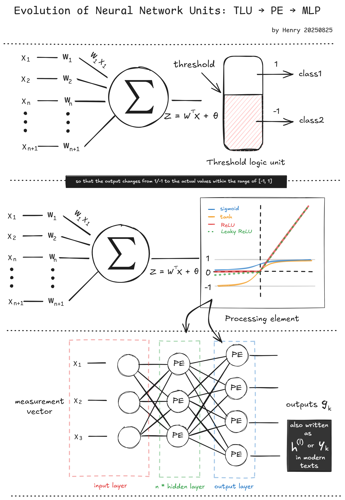
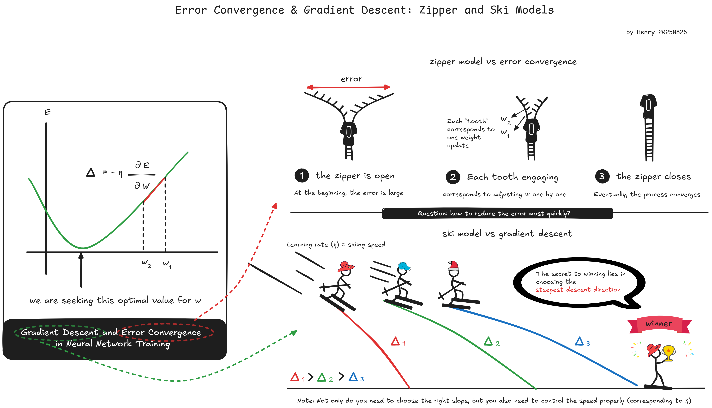
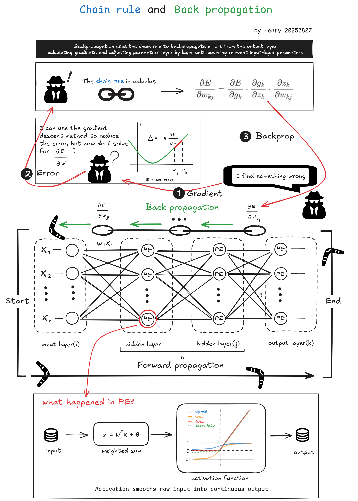
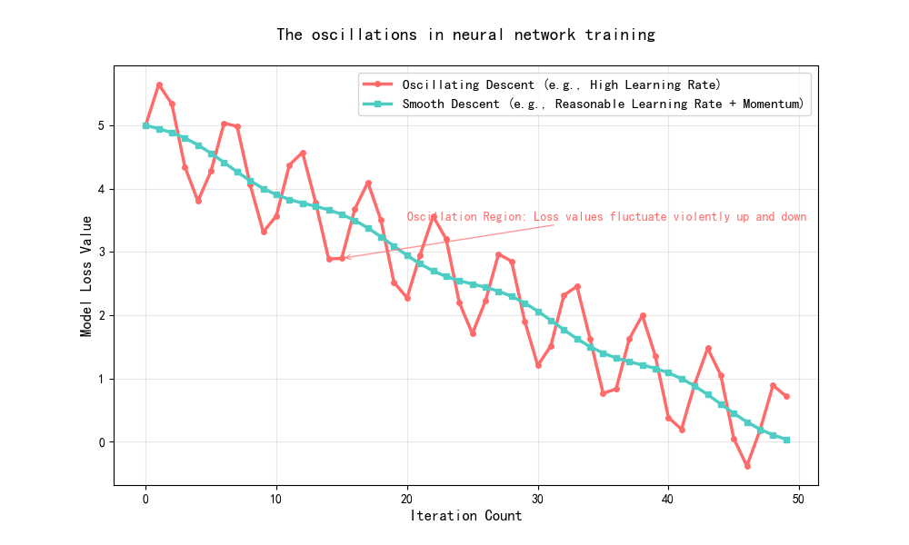
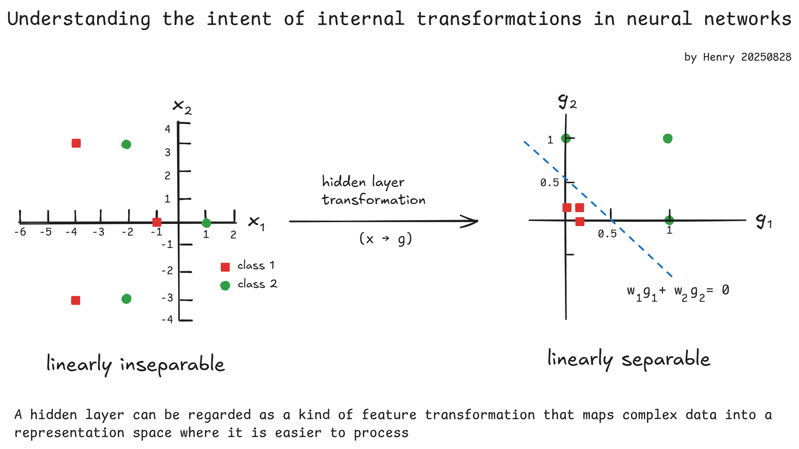

# REMOTE SENSING IMAGE ACQUISITION, ANALYSIS AND APPLICATIONS - Week 8

Course tutor: John Richards

All original diagrams © Henry Pan. Course slides are used under fair use for educational purposes. Not for commercial use.

## Lecture 11. The neural network as a classifier

NN was popular in the 1990s, but because of its complexity and computational demand, was supplanted by others, until the simpler version named "convolutional neural networks(CNN)"

Threshold logic unit (TLU) was used in the early stages, but it could only represent values of 1 and -1. Therefore, new techniques were developed, which are called activation functions. Some common activation functions:

.png)

| Activation Function | Order of Appearance | Output Range | Main Advantages                                              | Main Drawbacks                        | Improvement                             |
| ------------------- | ------------------- | ------------ | ------------------------------------------------------------ | ------------------------------------- | --------------------------------------- |
| Sigmoid             | Earliest            | (0, 1)       | Smooth, differentiable; used for binary classification output | Gradient vanishing; not zero-centered | —                                       |
| tanh                | Second              | (-1, 1)      | Zero-centered; faster convergence                            | Still suffers from gradient vanishing | Fixes Sigmoid’s non-zero-centered issue |
| ReLU                | Third               | [0, ∞)       | Solves gradient vanishing; computationally efficient         | Dead neuron problem                   | Addresses tanh’s gradient vanishing     |
| Leaky ReLU          | Fourth              | (-∞, ∞)      | Mitigates dead neuron issue                                  | Requires hyperparameter α             | Fixes ReLU’s dead neuron issue          |

Among them, Sigmoid could be expressed like:
$$
g = f(z) = \frac{1}{1 + \exp(-z/b)}
$$

- **θ (bias/threshold):** inherited from TLU, shifts the decision boundary
- **z (net input):** $z = w^Tx + θ$, the value before activation - z = "zone in"
- **g (output):** $g = f(z)$, the neuron’s activated result - g = generated output

### Multilayer Perceptron

> Each processing element has, as its inputs, the outputs of the processing elements in the preceding layer. Its weights,
> therefore, act as linkages between one laver and the next

#### 📒 Neural Network Notation: Traditional vs Modern

| Concept               | Traditional (older NN / signal processing) | Modern DL / ML (deep learning texts)         |
| --------------------- | ------------------------------------------ | -------------------------------------------- |
| **Weights**           | $w_{ji}$ → from neuron $i$ to neuron $j$   | $W^{(l)}$ → weight matrix of layer $l$       |
| **Bias / Offset**     | $\theta_j$                                 | $b_j$ (bias vector $b^{(l)}$)                |
| **Net Input**         | $z_j = \sum_i w_{ji} g_i + \theta_j$       | $z^{(l)} = W^{(l)} h^{(l-1)} + b^{(l)}$      |
| **Activation Output** | $g_j = f(z_j)$                             | $h^{(l)} = f(z^{(l)})$, sometimes $y_j$      |
| **Layer Notation**    | implicit (indices $i, j, k$)               | explicit superscripts $(l)$ for layer number |

To ensure a network learns well, it should be able to produce correct outputs when presented with new inputs (such as a pixel vector). Therefore, a metric is needed to measure how close the network's outputs are to the targets

#### 📒 Loss Function Comparison

Squared Error - 均方误差
$$
E = \frac{1}{2} \sum (t - g)^2
$$
Cross-Entropy - 交叉熵
$$
E = -\sum t \log(g)
$$

| Aspect             | **Squared Error (SSE/MSE)**                              | **Cross-Entropy (CE)**                                       |
| ------------------ | -------------------------------------------------------- | ------------------------------------------------------------ |
| **Output type**    | Real-valued (regression)                                 | Probabilities (classification)                               |
| **When common**    | Regression tasks; early NN courses (easier math)         | Classification tasks (softmax + CE is standard)              |
| **Interpretation** | Penalizes squared distance between prediction and target | Measures “distance” between predicted distribution and true distribution |
| **Advantages**     | - Simple & intuitive  - Easy derivative                  | - Matches probabilistic view  - Faster & more stable training in classification |
| **Disadvantages**  | - Less efficient for classification - Slower convergence | - Needs outputs in [0,1] (probabilities)                     |



## Lecture 12. Training the neural network

### step 1

For the weights linking the j and k layers this is
$$
w'_{kj} = w_{kj} - \eta \frac{\partial E}{\partial w_{kj}} = w_{kj} + \Delta w_{kj}
$$
where η is a positive constant, called the learning rate

---



---

$$
\frac{\partial E}{\partial w_{kj}} = \frac{\partial E}{\partial g_k} \cdot \frac{\partial g_k}{\partial z_k} \cdot \frac{\partial z_k}{\partial w_{kj}}
$$

- Break into pieces: First take the derivative of the outer function
- Layer-by-layer propagation: Similar to neural networks, where the error 𝐸 is back-propagated step by step until it reaches the weights 𝑤

$$
\tag{1}
\frac{\partial E}{\partial g_k} = - (t_k - g_k)
$$

$$
\tag{2}
\text{From} \quad g_k = \frac{1}{1 + \exp(-z_k / b)} \implies \frac{\partial g_k}{\partial z_k} = \frac{1}{b} g_k (1 - g_k)
$$

$$
\tag{3}
\text{From} \quad z_k = \sum_{k} (w_{kj} g_j + \theta_k) \implies \frac{\partial z_k}{\partial w_{kj}} = g_j
$$

Thus, choosing b=1 for convenience, we have
$$
\tag{A}
\Delta w_{kj} = - \eta \frac{\partial E}{\partial w_{kj}} = \eta (t_k - g_k)(1 - g_k) g_k g_j
$$

### step 2 

Now consider the weights linking the i and j layers
$$
\tag{4}
w'_{ji} = w_{ji} - \eta \frac{\partial E}{\partial w_{ji}} = w_{ji} + \Delta w_{ji}
$$

$$
\tag{5}
\text{in which, }
\eta \frac{\partial E}{\partial w_{ji}} = \frac{\partial E}{\partial g_j} \cdot \frac{\partial g_j}{\partial z_j} \cdot \frac{\partial z_j}{\partial w_{ji}} = \eta \frac{\partial E}{\partial g_j} \, (1 - g_j) g_j g_i
$$

we use chain rule again:
$$
\tag{6}
\frac{\partial E}{\partial g_j} = \sum_k \frac{\partial E}{\partial z_k} \cdot \frac{\partial z_k}{\partial g_j} = \sum_k \frac{\partial E}{\partial z_k} \, w_{kj}
$$
with (1)(2), and make b = 1, we have
$$
\tag{7}
\quad \frac{\partial E}{\partial z_k} = \frac{\partial E}{\partial g_k} \cdot \frac{\partial g_k}{\partial z_k} = - (t_k - g_k) g_k (1 - g_k)
$$
because of (5)(6)(7), so that
$$
\Delta w_{ji} = -\eta \frac{\partial E}{\partial w_{ji}} = \eta (1 - g_j) g_j g_i \sum_{k} (t_k - g_k) g_k (1 - g_k) w_{kj} \tag{B}
$$
From **step 1** we know how to calculate ∆w_kj, and thus the value of w_kj; so in principle we can now find the ∆w_ji, and thus the w_ji

if we write:
$$
\delta_k = (t_k - g_k)(1 - g_k)g_k
$$

$$
\delta_j = (1 - g_j)g_j \sum_{k} \delta_k w_{kj}
$$

so that
$$
\Delta w_{kj} = \eta \delta_k g_j
$$

$$
\Delta w_{ji} = \eta \delta_j g_i
$$

these mean "Update = learning rate × error term × input"

### **Neural Network Training Process**

1. **Forward pass with initial weights**
   - Start with arbitrary weights.
   - Perform a forward pass on the input data.
   - The outputs are computed but will contain errors compared to the targets.
2. **Backward pass and weight correction**
   - Compute the output layer error term ($\delta_k$) using the difference between target and prediction.
   - Propagate the error backward through hidden layers ($\delta_j$).
   - Update each weight using $\Delta w = \eta \delta g$.
   - Repeat until the overall error converges.



## Lecture 13. Neural network examples

> Note that: the MLP is belonged to fully connected

**First, how many hidden layers should be used?**

a single hidden layer is generally sufficient for RS

**Second, how many PE nodes should be in each layer?**

- input layer: as many as bands
- output layer:
  - as many as classes
  - if they are binary code, the number could be less
- hidden layer: should not be less than the number of output layer

The MLC trains about 10× faster, but the NN achieves higher accuracy and is about 2× faster at testing

### How to assist convergence

**Adding a momentum term**

during training the weight
$$
w' = w + \Delta w = w + \eta \delta g
$$
We now add another adjustment to the weights which assumes that the change at this iteration is likely to be not too
different from the previous adjustment. This is called a **momentum term**
$$
w' = w + \Delta w = w + \eta \delta g + \alpha \Delta w(-1) 
$$

- δ w(-1)  is the weight adjustment in the previous iteration
- α is a user-specified parameter that accounts for the degree to which momentum is used during training

```
Momentum is very common in neural network training; almost all modern optimizers include or inherit the idea of momentum. It can be regarded as a fundamental building block of optimization algorithms
```



**Adapting the learning and momentum rates**

Every forth iteration the authors adjust the learning and momentum rates:

- if the error is seen to be increasing then η and α are decreased
- if the error is seen to be decreasing then η and α are increased

> Training has to be initialized by the choice of a random set of weights


### Introduce to deep learning

Adding more hidden layers increases the network "depth". A deep learning network has several layers


